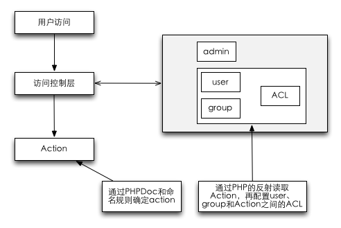

# 一种管理系统权限控制方式的实现

## 简介
做过web管理系统的，应该都遇到过权限控制问题，最简单的是在代码中需要什么权限直接判断，但维护成本较高。还有一些是通过配置文件实现的 [RBAC](http://en.wikipedia.org/wiki/Role-based_access_control)。 本文介绍的是RBAC的一种实现方式，可以达到通过web界面配置用户、用户组权限，来控制用户的访问权限和动态生成菜单。

## 实现原理
1. MVC设计模式（非必须）；
2. PHP反射；
3. 自定义的PHPDoc；
4. 全局、用户、用户组和角色；
5. web管理界面和数据库对配置信息的存储。

如果您能通过上面几点想到实现原理，下面的内容其实没什么新意，您可以去忙其他事了。  

### 流程简图


### 流程图说明
1. 权限控制分为：全局控制、用户组控制、用户控制、角色控制（暂时只包含管理员和用户），这里简化了用户角色，通过用户组来实现部分角色的细分功能；
2. 利用PHP的反射(Reflection)、PHPDoc和MVC中Action的命名来确定所有需要访问控制的列表（所以此设计的最细粒度到Action）；
3. 通过配置全局、用户组、用户和Action列表之间的访问关系（allow、deny）来控制访问；
4. 所有权限最终累加体现在用户身上，权限控制顺序：user > group > deny > allow；

## 代码事例
1. [代码片段](./rbac/code) ```注意，这里从框架中copy出的代码，不适合直接运行```
2. [数据库结构](./rbac/rbac.sql)

```
Controller
  |-- Acl
  |-- Menu
  `-- User
```

```
Model
  |-- ActionList
  |-- Acl
  |-- Menu
  `-- User
```

